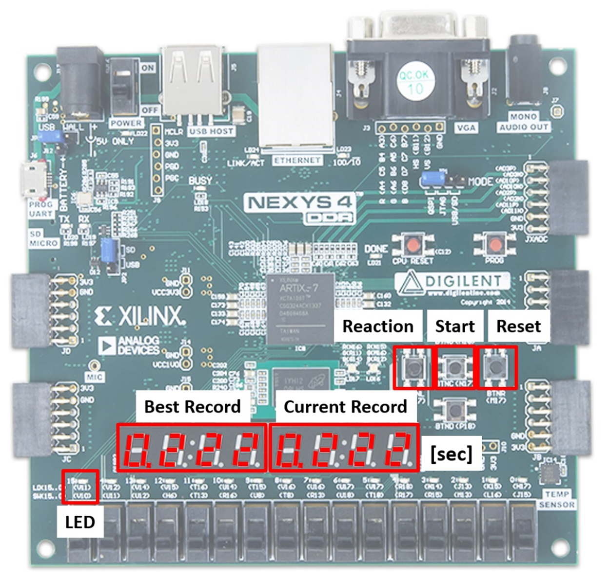
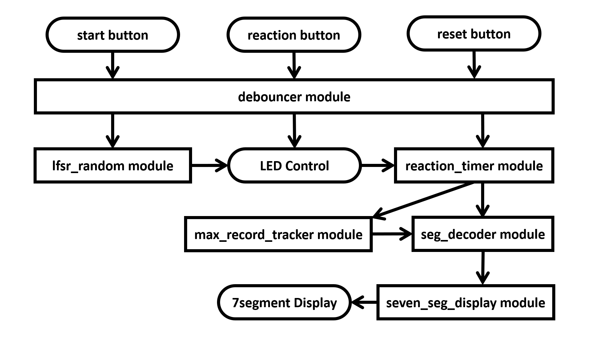
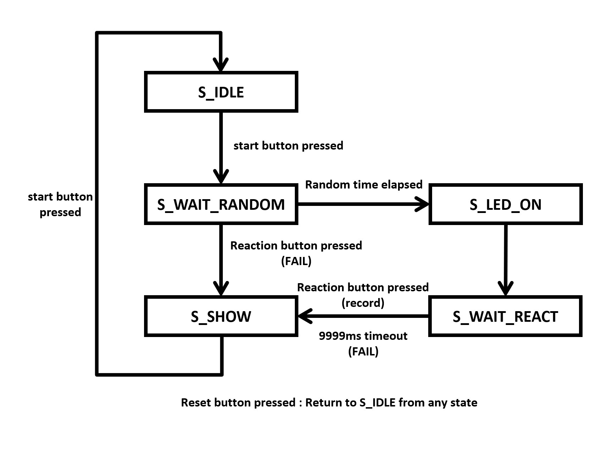

# FPGA 기반 반응 속도 테스트 게임

## 목차
- [프로젝트 개요](#프로젝트-개요)
- [특징](#특징)
- [사용 기술](#사용-기술)
- [시스템 아키텍처](#시스템-아키텍처)
- [모듈 설명](#모듈-설명)
- [설치 방법](#설치-방법)
- [사용법](#사용법)
- [개발 과정](#개발-과정)
- [성과 및 결과](#성과-및-결과)
- [향후 계획](#향후-계획)
- [적용 가능성](#적용-가능성)
- [결론](#결론)
- [문의](#문의)

[원문 README 보러 가기](README.md)

## 프로젝트 개요

본 프로젝트는 **Nexys4 DDR FPGA 보드**를 이용하여 Verilog로 구현한 **반응 속도 테스트 게임**입니다. 게임은 LED가 무작위로 켜질 때 사용자에게 가능한 한 빨리 버튼을 눌러 반응 속도를 테스트하도록 도전합니다. 반응 시간은 밀리초 단위로 측정되어 7-세그먼트 디스플레이에 표시되며, 달성된 최단 반응 시간(베스트 기록)도 함께 추적됩니다. 시스템은 LED가 켜지기 전에 버튼을 누르거나 타임아웃이 발생하는 등의 예외 상황을 처리하여 적절한 피드백을 제공합니다.



## 특징

- **무작위 LED 활성화:** 500ms에서 3500ms 사이의 무작위 간격으로 LED가 켜집니다.
- **정확한 반응 시간 측정:** 사용자의 반응 시간을 밀리초 단위로 정확히 측정하고 기록합니다.
- **베스트 기록 추적:** 가장 빠른 반응 시간을 유지하고 표시합니다.
- **예외 처리:** LED가 켜지기 전에 버튼을 누르거나 반응 시간이 9999ms를 초과할 경우 "FAIL" 메시지를 표시합니다.
- **실시간 디스플레이:** 7-세그먼트 디스플레이를 통해 현재 반응 시간과 베스트 기록을 실시간으로 표시합니다.
- **하드웨어 디바운싱:** 하드웨어 디바운싱 기법을 통해 안정적인 버튼 입력을 보장합니다.

## 사용 기술

- **FPGA 보드:** Nexys4 DDR (Xilinx Artix-7 FPGA)
- **하드웨어 기술 언어:** Verilog
- **개발 환경:** Vivado
- **난수 생성:** 선형 피드백 시프트 레지스터(LFSR)
- **타이밍 메커니즘:** 정밀한 타이밍을 위한 클록 디바이더

## 시스템 아키텍처

시스템은 모듈식 접근 방식을 사용하여 여러 개의 Verilog 모듈로 구성됩니다. 주요 구성 요소는 다음과 같습니다:

- **디바운서:** 안정적인 버튼 입력을 위한 디바운싱 처리.
- **클록 디바이더:** 1ms 타이밍 신호 생성.
- **LFSR 난수 생성기:** LED 활성화 간의 무작위 지연 생성.
- **반응 타이머:** LED 활성화와 버튼 누름 사이의 시간을 측정.
- **베스트 기록 추적기:** 가장 빠른 반응 시간 기록 유지.
- **7-세그먼트 디스플레이 컨트롤러:** 반응 시간과 상태 메시지 표시.
- **상태 머신:** 게임 상태 및 전환 관리.



### 상태 머신 다이어그램

| 상태              | 역할                                 | 전환 조건                                                        |
|--------------------|--------------------------------------|------------------------------------------------------------------|
| **S_IDLE**         | 초기 상태, 게임 시작 대기             | 시작 버튼 → S_WAIT_RANDOM<br>리셋 버튼 → S_IDLE 유지               |
| **S_WAIT_RANDOM**  | 무작위 지연 대기                     | 무작위 시간 경과 → S_LED_ON<br>반응 버튼 → S_SHOW (FAIL)<br>리셋 버튼 → S_IDLE |
| **S_LED_ON**       | LED 켜짐, 반응 타이머 시작             | 반응 버튼 → S_SHOW<br>리셋 버튼 → S_IDLE                         |
| **S_WAIT_REACT**   | 반응 입력 대기                        | 반응 버튼 → S_SHOW<br>타임아웃 → S_SHOW (FAIL)<br>리셋 버튼 → S_IDLE |
| **S_SHOW**         | 결과 표시                             | 시작 버튼 → S_WAIT_RANDOM<br>리셋 버튼 → S_IDLE                   |



## 모듈 설명

1. **reaction_game_top.v:** 모든 하위 모듈을 통합하고 게임 상태를 관리하는 최상위 모듈입니다.
2. **debouncer.v:** 버튼 입력의 하드웨어 디바운싱을 처리합니다.
3. **clock_divider.v:** 100MHz 시스템 클록에서 1ms 틱을 생성합니다.
4. **lfsr_random.v:** LFSR을 사용하여 무작위 지연 시간을 생성합니다.
5. **reaction_timer.v:** 밀리초 단위로 반응 시간을 측정합니다.
6. **max_record_tracker.v:** 최적의 반응 시간을 추적하고 업데이트합니다.
7. **seven_seg_display.v:** 반응 시간과 상태 메시지를 7-세그먼트 디스플레이에 표시합니다.
8. **seg_decoder.v:** 7-세그먼트 디스플레이를 위한 숫자 및 문자 입력을 디코딩합니다.

## 설치 방법

1. **레포지토리 클론:**

    ```bash
    git clone https://github.com/yourusername/fpga-reaction-speed-test-game.git
    ```

2. **Vivado에서 열기:**

    - Vivado를 실행하고 새 프로젝트를 생성합니다.
    - `src` 디렉토리에서 Verilog 소스 파일을 가져옵니다.
    - `constraints/Nexys4DDR_Master.xdc` 제약 파일을 추가합니다.

3. **빌드 및 업로드:**

    - Vivado에서 디자인을 합성하고 구현합니다.
    - 비트스트림을 생성한 후 Nexys4 DDR FPGA 보드에 업로드합니다.

## 사용법

1. **게임 시작:**
   - **시작 버튼** (BTNC)을 눌러 게임을 시작합니다.
   
2. **LED 활성화 대기:**
   - LED가 500ms에서 3500ms 사이의 무작위 지연 후에 켜집니다.

3. **반응:**
   - LED가 켜지면 가능한 한 빨리 **반응 버튼** (BTNL)을 눌러 반응 시간을 기록합니다.

4. **결과 확인:**
   - 반응 시간이 7-세그먼트 디스플레이에 표시됩니다.
   - 베스트 기록도 함께 추적 및 표시됩니다.

5. **예외 처리:**
   - LED가 켜지기 전에 반응 버튼을 누르거나 9999ms 내에 반응하지 않으면 "FAIL"이 표시됩니다.

6. **리셋:**
   - **리셋 버튼** (BTNR)을 눌러 기록을 초기화하고 게임을 재시작합니다.


## 개발 과정

본 프로젝트는 모듈식 접근 방식을 채택하여 개별 구성 요소를 쉽게 테스트하고 검증할 수 있도록 설계되었습니다. 각 Verilog 모듈은 Vivado에서 시뮬레이션을 통해 기능적 정확성을 검증한 후 최상위 디자인에 통합되었습니다. 다양한 예외 상황을 처리하고 시스템의 신뢰성을 보장하기 위해 광범위한 테스트가 수행되었습니다.

### 주요 도전 과제 및 해결 방안

- **타이머 디스플레이 문제:**
  - **문제점:** 반응 버튼을 누를 때까지 타이머가 정지된 것처럼 표시되었습니다.
  - **해결책:** 타이머 로직을 수정하여 버튼이 눌릴 때까지 지속적으로 업데이트되도록 변경했습니다.
  
- **버튼 스패밍 문제:**
  - **문제점:** LED가 켜지기 전에 반응 버튼을 여러 번 누르면 유효한 기록이 생성되었습니다.
  - **해결책:** FSM에 "FAIL" 조건을 추가하여 조기 버튼 누름을 감지하고 즉시 실패 상태를 표시하도록 했습니다.
  
- **9999ms 오버플로우 문제:**
  - **문제점:** 반응 시간이 9999ms를 초과하면 디스플레이에 잘못된 값이 표시되었습니다.
  - **해결책:** 반응 시간이 9999ms를 초과할 경우 "FAIL" 상태로 전환하여 올바른 피드백을 제공하도록 했습니다.
  
- **무작위 지연 패턴 문제:**
  - **문제점:** LFSR 난수 생성기가 반복적이어서 게임이 예측 가능해졌습니다.
  - **해결책:** LFSR 난수 생성기를 수정하여 지연 시간을 500ms에서 3500ms 범위로 조정, 변동성을 높였습니다.
  
- **베스트 기록 초기화 문제:**
  - **문제점:** 초기 베스트 기록이 0000으로 설정되어 제대로 업데이트되지 않았습니다.
  - **해결책:** 베스트 기록을 높은 값(16'hFFFF)으로 초기화하고 기록이 없을 경우 "----"을 표시하도록 했습니다.
  
- **시간 가독성 문제:**
  - **문제점:** 반응 시간이 밀리초 단위로만 표시되어 직관적이지 않았습니다.
  - **해결책:** 반응 시간을 x.xxx 초 형식으로 표시하고, 상태에 따라 소수점을 동적으로 제어하여 가독성을 향상시켰습니다.

## 성과 및 결과

- **정확한 반응 시간 측정:** 반응 시간을 0ms에서 9999ms 범위 내에서 정확하게 측정하고 x.xxx 형식으로 표시했습니다.
- **예외 처리:** 조기 버튼 누름과 타임아웃을 신뢰성 있게 감지하여 "FAIL" 메시지를 표시했습니다.
- **베스트 기록 관리:** 게임 세션 동안 가장 빠른 반응 시간을 추적하고 실시간으로 업데이트했습니다.
- **무작위 LED 타이밍:** LED 활성화가 500ms에서 3500ms 사이의 무작위 간격으로 발생하여 게임의 예측 가능성을 낮추고 흥미를 높였습니다.
- **사용자 피드백:** 7-세그먼트 디스플레이를 통해 실시간으로 반응 시간과 상태 메시지를 명확하게 표시했습니다.

## 향후 계획

- **VGA 출력 구현:** 외부 모니터에 게임 결과와 통계 정보를 표시하여 보다 시각적으로 풍부한 경험을 제공할 예정입니다.
- **향상된 사용자 인터페이스:** 평균 반응 시간 추세와 같은 추가 데이터를 표시하는 인터랙티브한 인터페이스를 개발할 계획입니다.
- **경쟁 기능 추가:** 멀티플레이어 기능을 도입하여 그룹 경쟁 및 훈련 환경을 지원할 예정입니다.

## 적용 가능성

본 반응 속도 테스트 게임은 **운전자 반응 평가 도구**로 적용될 수 있습니다. 운전 교육 센터나 자동차 안전 프로그램에서 급작스러운 시각적 신호에 대한 운전자의 반응 시간을 측정하여 교육 및 안전 평가에 활용할 수 있습니다. 여러 난이도 수준을 통합하여 다양한 운전 조건을 시뮬레이션하고, 평균 반응 시간과 추세를 분석함으로써 운전자의 향상 정도와 준비 상태를 평가할 수 있습니다.

## 결론

본 프로젝트는 Verilog와 FPGA 기술을 활용하여 응답성이 높고 인터랙티브한 반응 속도 테스트 게임을 성공적으로 구현하였습니다. 모듈식 설계, 견고한 상태 관리, 정밀한 타이밍 메커니즘을 통해 신뢰할 수 있는 성능을 보장하였으며, 시스템의 확장성을 통해 향후 다양한 응용 분야로의 확장이 가능합니다. 이 프로젝트는 디지털 설계와 FPGA 프로그래밍의 원리를 실용적으로 적용한 교육적 플랫폼으로서, 정확한 타이밍과 사용자 상호작용이 필요한 복잡한 시스템 개발의 기반을 마련하였습니다.

## 문의

- **학번:** 20221541
- **이름:** 이봄이
- **이메일:** spring0l@kookmin.ac.kr