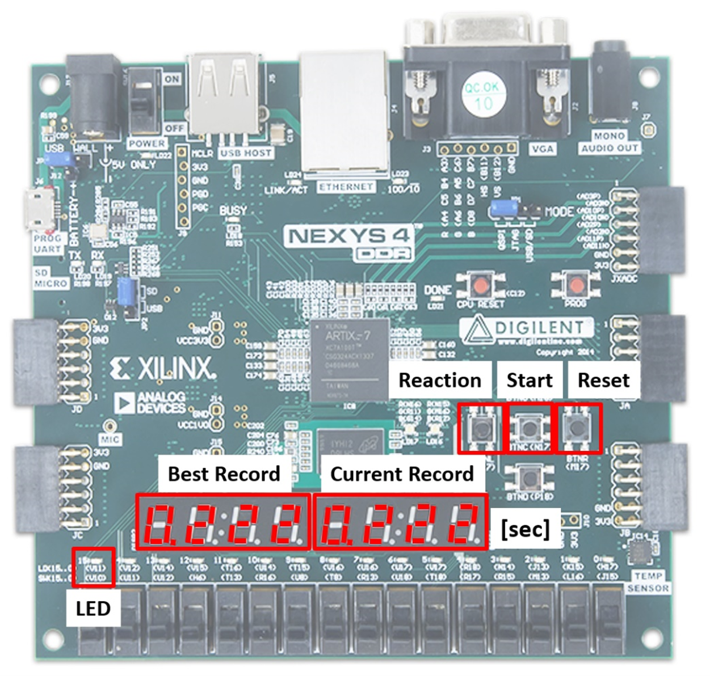

# FPGA-Based Reaction Speed Test Game

## Table of Contents
- [Project Overview](#project-overview)
- [Features](#features)
- [Technologies Used](#technologies-used)
- [System Architecture](#system-architecture)
- [Module Descriptions](#module-descriptions)
- [Installation](#installation)
- [Usage](#usage)
- [Development Process](#development-process)
- [Achievements and Results](#achievements-and-results)
- [Future Plans](#future-plans)
- [Applicability](#applicability)
- [Conclusion](#conclusion)
- [Contact](#contact)

[한국어 README 보러 가기](README-kr.md)

## Project Overview

This project implements a **Reaction Speed Test Game** on the Nexys4 DDR FPGA board using Verilog. The game challenges users to respond to randomly lit LEDs by pressing a button as quickly as possible. Reaction times are measured in milliseconds and displayed on a 7-segment display, alongside the best (shortest) reaction time achieved. The system handles edge cases, such as premature button presses or timeouts, by displaying appropriate feedback.



## Features

- **Randomized LED Activation:** LEDs light up at random intervals between 500ms and 3500ms.
- **Accurate Reaction Time Measurement:** Measures and records user reaction times in milliseconds.
- **Best Record Tracking:** Maintains and displays the best (shortest) reaction time.
- **Edge Case Handling:** Detects and handles premature button presses and reaction timeouts, displaying "FAIL" messages.
- **Real-Time Display:** Utilizes 7-segment displays to show current and best reaction times.
- **Hardware Debouncing:** Ensures reliable button inputs through hardware debouncing techniques.

## Technologies Used

- **FPGA Board:** Nexys4 DDR (Xilinx Artix-7 FPGA)
- **Hardware Description Language:** Verilog
- **Development Environment:** Vivado
- **Random Number Generation:** Linear Feedback Shift Register (LFSR)
- **Timing Mechanisms:** Clock dividers for precise timing

## System Architecture

The system is designed using a modular approach, dividing the project into distinct Verilog modules. The main components include:

- **Debouncers:** For stable button inputs.
- **Clock Divider:** Generates a 1ms timing signal.
- **LFSR Random Generator:** Creates random delays between LED activations.
- **Reaction Timer:** Measures the time between LED activation and button press.
- **Best Record Tracker:** Keeps track of the fastest reaction time.
- **7-Segment Display Controller:** Displays reaction times and status messages.
- **State Machine:** Manages game states and transitions.


### State Machine Diagram

| State              | Role                                 | Transition Conditions                                                        |
|--------------------|--------------------------------------|------------------------------------------------------------------------------|
| **S_IDLE**         | Initial state, waiting to start      | Start Button → S_WAIT_RANDOM<br>Reset Button → Stay in S_IDLE                |
| **S_WAIT_RANDOM**  | Waiting for a random delay           | Random time elapsed → S_LED_ON<br>Reaction Button → S_SHOW (FAIL)<br>Reset Button → S_IDLE |
| **S_LED_ON**       | LED on, reaction timer starts        | Reaction Button → S_SHOW<br>Reset Button → S_IDLE                           |
| **S_WAIT_REACT**   | Waiting for reaction input           | Reaction Button → S_SHOW<br>Timeout → S_SHOW (FAIL)<br>Reset Button → S_IDLE  |
| **S_SHOW**         | Displaying result                     | Start Button → S_WAIT_RANDOM<br>Reset Button → S_IDLE                       |


## Module Descriptions

1. **reaction_game_top.v:** Top-level module integrating all sub-modules and managing game states.
2. **debouncer.v:** Handles hardware debouncing of button inputs.
3. **clock_divider.v:** Generates a 1ms tick from the 100MHz system clock.
4. **lfsr_random.v:** Generates random delays using an LFSR.
5. **reaction_timer.v:** Measures reaction time in milliseconds.
6. **max_record_tracker.v:** Tracks and updates the best reaction time.
7. **seven_seg_display.v:** Controls the 7-segment displays to show times and messages.
8. **seg_decoder.v:** Decodes numerical and character inputs for the 7-segment display.

## Installation

1. **Clone the Repository:**

    ```bash
    git clone https://github.com/yourusername/fpga-reaction-speed-test-game.git
    ```

2. **Open in Vivado:**

    - Launch Vivado and create a new project.
    - Import the Verilog source files from the `src` directory.
    - Add the `constraints/Nexys4DDR_Master.xdc` constraints file.

3. **Build and Upload:**

    - Synthesize and implement the design in Vivado.
    - Generate the bitstream and upload it to the Nexys4 DDR FPGA board.

## Usage

1. **Start the Game:**
   - Press the **Start Button** (BTNC) to initiate the game.

2. **Wait for LED Activation:**
   - The LED will light up after a random delay between 500ms and 3500ms.

3. **React:**
   - Press the **Reaction Button** (BTNL) as quickly as possible once the LED lights up.

4. **View Results:**
   - The reaction time will be displayed on the 7-segment display.
   - The best reaction time is also tracked and displayed.

5. **Handle Edge Cases:**
   - Pressing the Reaction Button prematurely or failing to respond within 9999ms will display "FAIL".

6. **Reset:**
   - Press the **Reset Button** (BTNR) to clear records and restart the game.


## Development Process

The project was developed using a modular approach, allowing for easy testing and verification of individual components. Each Verilog module was simulated in Vivado to ensure functional accuracy before integrating into the top-level design. Extensive testing was conducted to handle various edge cases and ensure system reliability.

### Key Challenges and Solutions

- **Timer Display Issue:**
  - **Issue:** The timer appeared frozen until the Reaction Button was pressed.
  - **Solution:** Modified the timer logic to continuously update the display, improving user intuitiveness.
  
- **Button Spamming:**
  - **Issue:** Pressing the Reaction Button multiple times before the LED lit up resulted in valid records.
  - **Solution:** Implemented a "FAIL" condition to detect premature button presses, enhancing system reliability.
  
- **9999ms Overflow:**
  - **Issue:** Exceeding 9999ms caused incorrect or undefined values to appear on the display.
  - **Solution:** Added a timeout condition to prevent display overflows, ensuring proper feedback.
  
- **Random Delay Predictability:**
  - **Issue:** The random delay appeared repetitive, making the game predictable.
  - **Solution:** Adjusted the LFSR to increase variability in LED activation delays.
  
- **Best Record Initialization:**
  - **Issue:** The initial best record was set to 0000, preventing proper updates.
  - **Solution:** Initialized the best record to a high value to allow proper updates and clear "no record" states.
  
- **Time Readability:**
  - **Issue:** The reaction time was displayed only in milliseconds, which was not intuitive.
  - **Solution:** Enhanced the display format to x.xxx seconds with dynamic decimal point control for clarity.

## Achievements and Results

- **Accurate Reaction Time Measurement:** Successfully measured and displayed reaction times with high precision.
- **Reliable Input Handling:** Ensured stable button inputs through hardware debouncing.
- **Effective Edge Case Management:** Robustly handled premature button presses and reaction timeouts.
- **Real-Time Feedback:** Provided immediate and clear feedback through LEDs and 7-segment displays.
- **Best Record Tracking:** Accurately maintained and updated the best reaction time across game sessions.

## Future Plans

- **VGA Output:** Implement VGA output to display game results and statistics on an external monitor for a more engaging visual experience.
- **Enhanced User Interface:** Develop a more interactive interface with additional features like average reaction time trends.
- **Competitive Features:** Enable multiplayer functionality for group competitions and training environments.

## Applicability

The reaction speed test game can be applied as a **driver reflex assessment tool** in driver training centers or automotive safety programs. It measures and displays drivers' reaction times to sudden visual cues, aiding in training and safety evaluations. The system's design principles are also applicable to other real-time interactive applications in digital systems and embedded devices.

## Conclusion

This project demonstrates the effective use of Verilog and FPGA technology to create a responsive and interactive reaction speed test game. The modular design, robust state management, and precise timing mechanisms ensure reliable performance, while the system's scalability allows for future enhancements and broader applications.

## Contact

- **Student ID:** 20221541
- **Name:** 이봄이
- **Email:** spring0l@kookmin.ac.kr